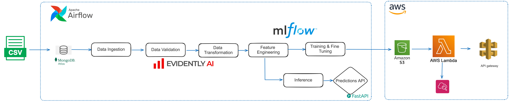

# Hotel Reservation Cancellation Prediction

## Project Overview

This project aims to design an end-to-end machine learning (ML) system for predicting hotel reservation cancellations. The objectives are twofold: 

1. **End-to-End ML System**: Create a complete ML workflow from the data science project to deployment on AWS, utilizing CI/CD with GitHub Actions.
2. **Causal Machine Learning**: Utilize causal machine learning techniques to predict whether a customer will cancel their reservation.

## Code Architecture

The project is divided into several components:

### 1. Data Ingestion
- Data will be ingested directly from MongoDB Atlas.

### 2. Data Validation
- This component validates the expected columns and returns `False` if any important columns for prediction are missing.

### 3. Data Transformation
- This component involves transforming the data, including:
  - Converting object features to numerical values.
  - Splitting the data into training and test sets.
  - Verifying data drift with Evidently AI.

### 4. Feature Engineering
- This part involves conducting analysis to add significant variables that provide more information about the customer while reducing the amount of data.

### 5. Training
- Train models using Random Forest and Gradient Boosting with hyperparameter tuning via Random Search. Although other models could be explored, the primary aim of this project is deployment.
- Monitor model performance using MLflow.

### 6. Inference
- This component is responsible for running the inference pipeline on new data.
